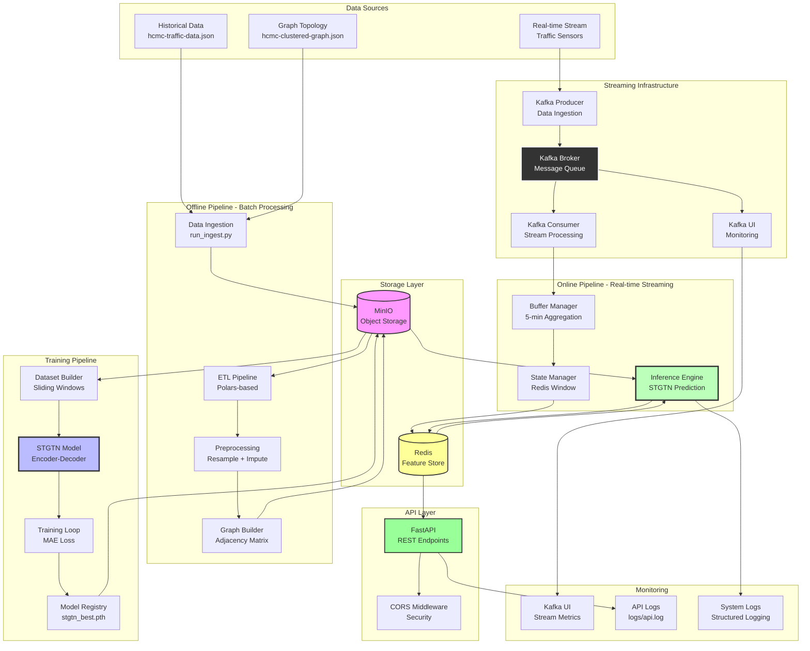
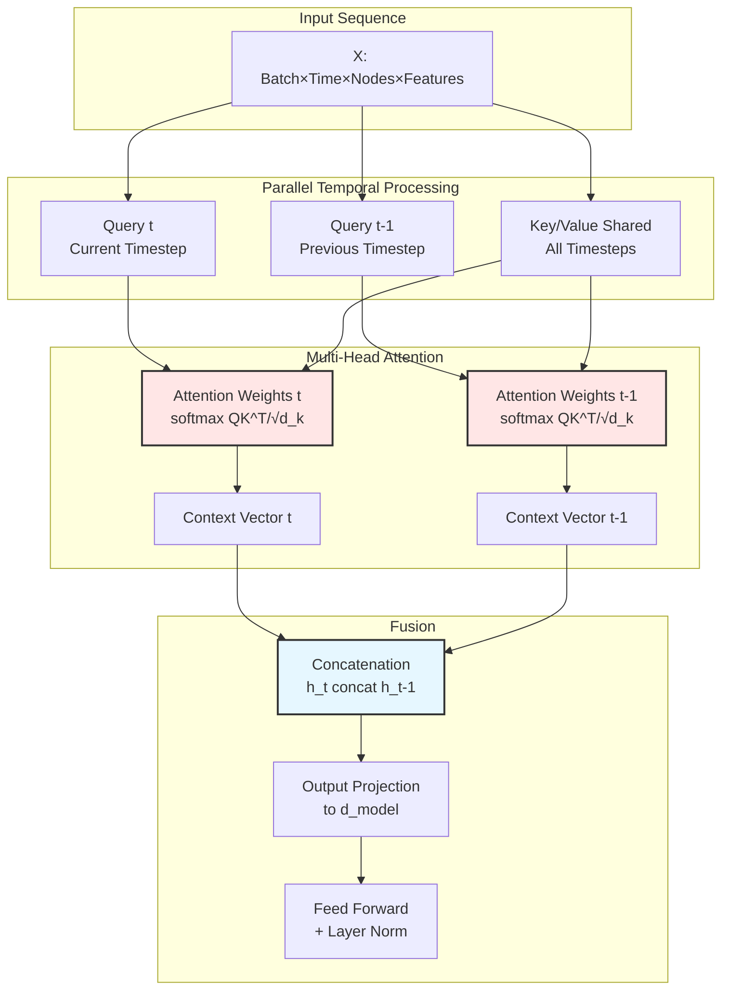
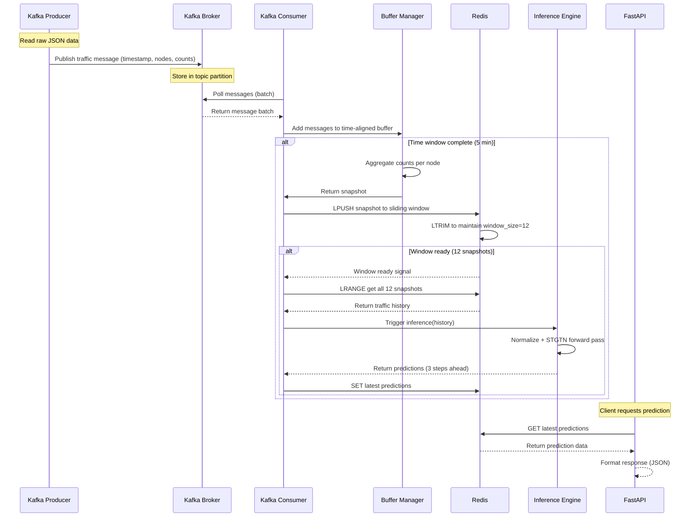

# 🚦 HCMC Real-time Traffic Forecasting with MLOps

> **Production-grade Spatial-Temporal Graph Neural Network for real-time traffic prediction in Ho Chi Minh City**

[](https://www.python.org/)
[](https://pytorch.org/)
[](https://kafka.apache.org/)
[](https://redis.io/)
[](https://fastapi.tiangolo.com/)
[](https://min.io/)
[](LICENSE)

A complete end-to-end MLOps pipeline for real-time traffic forecasting using **Spatial-Temporal Graph Transformer Networks (STGTN)**, implementing state-of-the-art research with production-ready infrastructure including **streaming architecture**, **REST API serving**, and **containerized deployment**.

---

## 📊 Project Highlights

- 🧠 **Deep Learning Architecture**: Custom STGTN with Dual Temporal Attention
- 🗺️ **Graph Neural Networks**: Laplacian Positional Encoding for spatial dependencies
- ⚙️ **Hybrid MLOps Pipeline**: Batch processing + Real-time streaming
- 🔄 **Kafka Streaming**: Real-time data ingestion and processing
- 💾 **Redis Feature Store**: Sub-millisecond state management
- 🚀 **FastAPI Serving**: Production-ready REST API
- 🗄️ **Object Storage**: MinIO for scalable data versioning
- 📈 **Real-time Prediction**: Sub-second inference on 125 traffic nodes
- 🎯 **Performance**: MAE < 5 vehicles, RMSE < 7 vehicles on test set
- 🐳 **Containerized**: Docker Compose orchestration

---

## 🏗️ System Architecture

### Complete Production MLOps Pipeline


```mermaid
graph TB
    subgraph "Data Sources"
        A1[Historical Data<br/>hcmc-traffic-data.json]
        A2[Graph Topology<br/>hcmc-clustered-graph.json]
        A3[Real-time Stream<br/>Traffic Sensors]
    end
    
    subgraph "Storage Layer"
        B1[(MinIO<br/>Object Storage)]
        B2[(Redis<br/>Feature Store)]
    end
    
    subgraph "Streaming Infrastructure"
        K1[Kafka Producer<br/>Data Ingestion]
        K2[Kafka Broker<br/>Message Queue]
        K3[Kafka Consumer<br/>Stream Processing]
        K4[Kafka UI<br/>Monitoring]
    end
    
    subgraph "Offline Pipeline - Batch Processing"
        C1[Data Ingestion<br/>run_ingest.py]
        C2[ETL Pipeline<br/>Polars-based]
        C3[Preprocessing<br/>Resample + Impute]
        C4[Graph Builder<br/>Adjacency Matrix]
    end
    
    subgraph "Training Pipeline"
        D1[Dataset Builder<br/>Sliding Windows]
        D2[STGTN Model<br/>Encoder-Decoder]
        D3[Training Loop<br/>MAE Loss]
        D4[Model Registry<br/>stgtn_best.pth]
    end
    
    subgraph "Online Pipeline - Real-time Streaming"
        E1[Buffer Manager<br/>5-min Aggregation]
        E2[State Manager<br/>Redis Window]
        E3[Inference Engine<br/>STGTN Prediction]
    end
    
    subgraph "API Layer"
        F1[FastAPI<br/>REST Endpoints]
        F2[CORS Middleware<br/>Security]
    end
    
    subgraph "Monitoring"
        G1[Kafka UI<br/>Stream Metrics]
        G2[API Logs<br/>logs/api.log]
        G3[System Logs<br/>Structured Logging]
    end
    
    %% Data Flow - Offline
    A1 --> C1
    A2 --> C1
    C1 --> B1
    B1 --> C2
    C2 --> C3
    C3 --> C4
    C4 --> B1
    
    %% Training Flow
    B1 --> D1
    D1 --> D2
    D2 --> D3
    D3 --> D4
    D4 --> B1
    
    %% Real-time Flow
    A3 --> K1
    K1 --> K2
    K2 --> K3
    K3 --> E1
    E1 --> E2
    E2 --> B2
    B2 --> E3
    B1 --> E3
    E3 --> B2
    
    %% API Flow
    B2 --> F1
    F1 --> F2
    
    %% Monitoring
    K2 --> K4
    K4 --> G1
    F1 --> G2
    E3 --> G3
    
    style B1 fill:#f9f,stroke:#333,stroke-width:2px
    style B2 fill:#ff9,stroke:#333,stroke-width:2px
    style K2 fill:#333,stroke:#fff,stroke-width:2px,color:#fff
    style D2 fill:#bbf,stroke:#333,stroke-width:3px
    style E3 fill:#bfb,stroke:#333,stroke-width:3px
    style F1 fill:#9f9,stroke:#333,stroke-width:2px
```

### STGTN Model Architecture


```mermaid
graph LR
    subgraph "Input Layer"
        A1[Traffic Flow<br/>Time×Nodes×1]
        A2[Adjacency Matrix<br/>Nodes×Nodes]
    end
    
    subgraph "Embedding Layer"
        B1[Input Embedding<br/>→ d_model=64]
        B2[Laplacian Pos Enc<br/>Spectral Features]
    end
    
    subgraph "Encoder Stack"
        C1[STGT Layer 1<br/>Dual Temporal Attn]
        C2[STGT Layer 2<br/>Dual Temporal Attn]
        C3[Encoder MLP<br/>2× Hidden + ReLU]
    end
    
    subgraph "Decoder Stack"
        D1[STGT Layer 1<br/>Auto-regressive]
        D2[STGT Layer 2<br/>Auto-regressive]
        D3[Output Projection<br/>→ 1 Feature]
    end
    
    subgraph "Output"
        E1[Predictions<br/>3 Steps Ahead]
    end
    
    A1 --> B1
    A2 --> B2
    B1 --> B2
    B2 --> C1
    C1 --> C2
    C2 --> C3
    C3 --> D1
    D1 --> D2
    D2 --> D3
    D3 --> E1
    
    style C1 fill:#ffcccc,stroke:#333,stroke-width:2px
    style C2 fill:#ffcccc,stroke:#333,stroke-width:2px
    style D1 fill:#ccffcc,stroke:#333,stroke-width:2px
    style D2 fill:#ccffcc,stroke:#333,stroke-width:2px
    style E1 fill:#ffd700,stroke:#333,stroke-width:3px
```

### Dual Temporal Attention Mechanism


```mermaid
graph TB
    subgraph "Input Sequence"
        A[X: Batch×Time×Nodes×Features]
    end
    
    subgraph "Parallel Temporal Processing"
        B1[Query t<br/>Current Timestep]
        B2[Query t-1<br/>Previous Timestep]
        C1[Key/Value Shared<br/>All Timesteps]
    end
    
    subgraph "Multi-Head Attention"
        D1[Attention Weights t<br/>softmax QK^T/√d_k]
        D2[Attention Weights t-1<br/>softmax QK^T/√d_k]
        E1[Context Vector t]
        E2[Context Vector t-1]
    end
    
    subgraph "Fusion"
        F["Concatenation<br/>h_t concat h_t-1"]
        G["Output Projection<br/>to d_model"]
        H["Feed Forward<br/>+ Layer Norm"]
    end
    
    A --> B1
    A --> B2
    A --> C1
    B1 --> D1
    B2 --> D2
    C1 --> D1
    C1 --> D2
    D1 --> E1
    D2 --> E2
    E1 --> F
    E2 --> F
    F --> G
    G --> H
    
    style D1 fill:#ffe6e6,stroke:#333,stroke-width:2px
    style D2 fill:#ffe6e6,stroke:#333,stroke-width:2px
    style F fill:#e6f7ff,stroke:#333,stroke-width:2px
```

### Real-time Streaming Data Flow


```mermaid
sequenceDiagram
    participant P as Kafka Producer
    participant K as Kafka Broker
    participant C as Kafka Consumer
    participant B as Buffer Manager
    participant R as Redis
    participant I as Inference Engine
    participant A as FastAPI
    
    Note over P: Read raw JSON data
    P->>K: Publish traffic message (timestamp, nodes, counts)
    Note over K: Store in topic partition
    
    C->>K: Poll messages (batch)
    K-->>C: Return message batch
    
    C->>B: Add messages to time-aligned buffer
    
    alt Time window complete (5 min)
        B->>B: Aggregate counts per node
        B->>C: Return snapshot
        C->>R: LPUSH snapshot to sliding window
        R->>R: LTRIM to maintain window_size=12
        
        alt Window ready (12 snapshots)
            R-->>C: Window ready signal
            C->>R: LRANGE get all 12 snapshots
            R-->>C: Return traffic history
            
            C->>I: Trigger inference(history)
            I->>I: Normalize + STGTN forward pass
            I-->>C: Return predictions (3 steps ahead)
            
            C->>R: SET latest predictions
        end
    end
    
    Note over A: Client requests prediction
    A->>R: GET latest predictions
    R-->>A: Return prediction data
    A-->>A: Format response (JSON)
```

---

## 🚀 Key Technical Features

### 1. **Advanced Deep Learning**
- **STGTN Architecture**: Encoder-Decoder with Dual Temporal Attention
- **Laplacian Positional Encoding**: Graph spectral features for spatial awareness
- **Auto-regressive Decoder**: Multi-step ahead prediction (15 minutes)
- **Gradient Clipping**: Stable training with MAE loss

### 2. **Real-time Streaming Infrastructure**
- **Kafka Broker**: High-throughput message queue with KRaft mode
- **Stream Producer**: Configurable speed simulation (10x - 100x real-time)
- **Stream Consumer**: Time-aligned buffering with 5-minute aggregation
- **Kafka UI**: Real-time monitoring dashboard at http://localhost:8080

### 3. **Redis Feature Store**
- **Sliding Window Management**: FIFO queue for 12 timesteps (1-hour history)
- **Atomic Operations**: Pipeline-based push/pop for consistency
- **State Readiness Check**: Automated window validation
- **Sub-millisecond Latency**: Optimized for real-time inference

### 4. **Production API Serving**
- **FastAPI Framework**: Async REST endpoints with OpenAPI docs
- **CORS Support**: Cross-origin resource sharing for frontend integration
- **Health Checks**: Lifespan management with Redis connection pooling
- **Pydantic Validation**: Type-safe request/response models

### 5. **Hybrid MLOps Pipeline**
- **Batch Processing**: Historical data ETL with Polars (10x faster than Pandas)
- **Stream Processing**: Real-time ingestion with Kafka integration
- **Model Registry**: MinIO-backed checkpoint versioning
- **Reproducibility**: Fixed random seeds and deterministic operations

### 6. **Comprehensive Monitoring**
- **Stream Metrics**: Kafka UI for throughput, lag, and consumer health
- **API Logging**: Structured logs with timestamps (logs/api.log)
- **Prediction Metrics**: MAE, RMSE, MAPE on denormalized outputs
- **System Observability**: Multi-layer logging (producer, consumer, API)

---

## 📂 Project Structure

```
hcmc_realtime_traffic_forecasting_MLOps/
├── data/                           # Local data cache
│   ├── raw/                        # Raw JSON files
│   ├── processed/                  # Processed NPY/Parquet files
│   └── realtime/                   # Real-time simulation data
│
├── src/                            # Source code modules
│   ├── core/
│   │   ├── graph/                  # Graph topology builders
│   │   │   ├── adjacency_builder.py
│   │   │   ├── loader.py
│   │   │   └── topology.py
│   │   └── storage/                # Storage abstraction layer
│   │       ├── minio_client.py     # MinIO S3-compatible client
│   │       ├── kafka_client.py     # Kafka producer/consumer factory
│   │       └── redis_client.py     # Redis state manager
│   │
│   ├── offline/                    # Batch processing pipeline
│   │   ├── pipeline.py             # ETL orchestration
│   │   ├── extractors/             # Data extraction from MinIO
│   │   ├── transformers/           # Resampling & imputation
│   │   └── ingestors/              # Local to MinIO upload
│   │
│   ├── online/                     # Real-time streaming pipeline
│   │   ├── producer.py             # Kafka traffic data producer
│   │   └── consumer.py             # Kafka consumer with Redis integration
│   │
│   ├── api/                        # REST API serving layer
│   │   └── main.py                 # FastAPI application with endpoints
│   │
│   ├── training/                   # Model training utilities
│   │   └── dataset.py              # PyTorch Dataset with sliding windows
│   │
│   └── model/                      # Deep learning models
│       ├── stgtn.py                # STGTN implementation
│       └── inference.py            # Inference engine
│
├── scripts/                        # Executable entry points
│   ├── run_ingest.py               # Upload raw data to MinIO
│   ├── run_pipeline.py             # Execute offline preprocessing
│   ├── train.py                    # Model training pipeline
│   ├── run_producer.py             # Start Kafka producer
│   ├── run_consumer.py             # Start Kafka consumer
│   └── generate_node_ids_config.py # Configuration generator
│
├── tests/                          # Testing suite
│   ├── test_integration.py         # End-to-end integration tests
│   ├── test_pipeline.py            # Pipeline component tests
│   └── tmp_load_nodes.py           # Node loading utilities
│
├── benchmarks/                     # Performance benchmarks
│   ├── benchmark.py                # Model performance benchmarking
│   ├── process_history_data.py     # Historical data processing
│   └── test_stgtn_refactored.py    # Architecture validation
│
├── models/                         # Model artifacts
│   ├── config.json                 # Hyperparameters + normalization params
│   └── stgtn_best.pth              # Best checkpoint
│
├── logs/                           # Application logs
│   ├── producer.log                # Kafka producer logs
│   ├── consumer.log                # Kafka consumer logs
│   ├── api.log                     # FastAPI logs
│   ├── training.log                # Training logs
│   └── predictions.csv             # Prediction history
│
├── docs/                           # Comprehensive documentation
│   ├── ARCHITECTURE_GAP_ANALYSIS.md       # Architecture evolution
│   ├── KAFKA_SETUP_GUIDE.md               # Kafka setup instructions
│   ├── KAFKA_QUICK_REFERENCE.md           # Kafka commands cheatsheet
│   ├── PIPELINE_IMPLEMENTATION_COMPLETE.md # Pipeline documentation
│   ├── STGTN_methodology_summary.md       # Research methodology
│   └── STGTN_Refactoring_Report.md        # Code refactoring report
│
├── minio_data/                     # MinIO persistent storage
│   └── hcmc-traffic-data/
│       ├── raw/                    # Raw data bucket
│       └── processed/              # Processed data bucket
│
├── docker-compose.yml              # Container orchestration
│   ├── MinIO (Object Storage)
│   ├── Kafka (Message Broker)
│   ├── Kafka UI (Monitoring)
│   └── Redis (Feature Store)
│
├── requirements.txt                # Python dependencies
├── .env                            # Environment variables
└── README.md                       # This file
```

---

## 🛠️ Technology Stack

### Deep Learning & ML
- **PyTorch 2.0+**: Neural network training and inference
- **NumPy**: Numerical computations and array operations
- **Scikit-learn**: Metrics (MAE, RMSE, MAPE)

### Data Engineering
- **Polars**: High-performance DataFrame operations (10x Pandas)
- **Pandas**: Data manipulation and CSV I/O
- **MinIO**: Distributed object storage (S3-compatible)
- **Boto3**: AWS SDK for MinIO integration
- **PyArrow**: Columnar data format (Parquet)

### Streaming & Messaging
- **Apache Kafka**: Distributed event streaming platform
- **kafka-python**: Python client for Kafka
- **Kafka UI**: Web-based monitoring and management

### State Management & Caching
- **Redis**: In-memory data store for feature store
- **redis-py**: Python Redis client with connection pooling

### API & Web Services
- **FastAPI**: Modern async web framework
- **Uvicorn**: ASGI server for FastAPI
- **Pydantic**: Data validation with type hints

### MLOps & DevOps
- **Docker Compose**: Multi-container orchestration
- **Python Logging**: Structured logging with file handlers
- **python-dotenv**: Environment variable management
- **Git**: Version control and collaboration

### Testing & Quality
- **pytest**: Unit and integration testing
- **pytest-cov**: Code coverage reporting
- **flake8**: Code linting and style checking

### Visualization
- **Matplotlib**: Prediction plots and charts
- **Mermaid**: Architecture diagrams

---

## ⚙️ Installation & Setup

### 1. Prerequisites
```bash
# Python 3.12+
python --version

# Docker & Docker Compose
docker --version
docker-compose --version
```

### 2. Clone Repository
```bash
git clone https://github.com/yourusername/hcmc_realtime_traffic_forecasting_MLOps.git
cd hcmc_realtime_traffic_forecasting_MLOps
```

### 3. Create Virtual Environment
```bash
python -m venv .venv
source .venv/bin/activate  # Linux/Mac
# .venv\Scripts\activate   # Windows
```

### 4. Install Dependencies
```bash
pip install -r requirements.txt
```

### 5. Configure Environment Variables
```bash
# Create .env file
cp .env.example .env

# Edit with your credentials
# MinIO Configuration
MINIO_ENDPOINT_URL=http://localhost:9000
MINIO_ACCESS_KEY=minioadmin
MINIO_SECRET_KEY=minioadmin
MINIO_BUCKET_NAME=hcmc-traffic-data

# Kafka Configuration
KAFKA_BROKER=localhost:9092
KAFKA_TOPIC=traffic-raw
KAFKA_GROUP_ID=traffic-consumer-group

# Redis Configuration
REDIS_HOST=localhost
REDIS_PORT=6379
REDIS_DB=0
WINDOW_SIZE=12
```

### 6. Start Infrastructure Services
```bash
# Start all services (MinIO, Kafka, Redis, Kafka UI)
docker-compose up -d

# Verify services are running
docker ps

# Access web interfaces
# - MinIO Console: http://localhost:9001 (minioadmin / minioadmin)
# - Kafka UI: http://localhost:8080
```

### 7. Initialize MinIO Buckets (First Time Only)
```bash
# The bucket will be automatically created when running ingest script
python scripts/run_ingest.py
```

---

## 🎯 Usage Guide

### Part 1: Offline Pipeline (Batch Processing)

#### Step 1: Data Ingestion
Upload raw traffic and graph data to MinIO:
```bash
python scripts/run_ingest.py
```
**Output**: Files uploaded to `hcmc-traffic-data/raw/` bucket

#### Step 2: Offline Preprocessing
Execute ETL pipeline (extraction → resampling → imputation → validation):
```bash
python scripts/run_pipeline.py
```
**Output**: 
- `processed/traffic_clean.parquet` (125 nodes × ~2000 timesteps)
- `processed/adj_matrix.npy` (125×125 adjacency matrix)

#### Step 3: Model Training
Train STGTN model with best hyperparameters:
```bash
python scripts/train.py \
    --epochs 100 \
    --batch_size 32 \
    --lr 0.001 \
    --input_len 12 \
    --output_len 3 \
    --d_model 64 \
    --nhead 4
```
**Output**:
- `models/stgtn_best.pth` (best checkpoint)
- `models/config.json` (hyperparameters + max_flow)
- `logs/training.log`

---

### Part 2: Online Pipeline (Real-time Stream Processing)

#### Step 4: Start Kafka Producer
Stream traffic data to Kafka broker:
```bash
python scripts/run_producer.py --speed 10.0
```
**Parameters**:
- `--speed`: Simulation speed multiplier (10.0 = 10x faster than real-time)
- `--file`: Path to input data file (default: `data/realtime/hcmc-traffic-data-realtime.json`)
- `--broker`: Kafka broker URL (default: `localhost:9092`)

**Output**:
- Messages published to `traffic-raw` topic
- Logs in `logs/producer.log`
- Monitor in Kafka UI: http://localhost:8080

#### Step 5: Start Kafka Consumer
Process streaming data and store in Redis:
```bash
python scripts/run_consumer.py
```
**Process**:
1. Consume messages from Kafka topic
2. Aggregate data into 5-minute snapshots
3. Push snapshots to Redis sliding window (12 timesteps)
4. Trigger inference when window is ready

**Output**:
- Traffic snapshots in Redis
- Logs in `logs/consumer.log`
- State tracked in Redis: `traffic:window:12` key

---

### Part 3: API Serving (Production Deployment)

#### Step 6: Start FastAPI Server
Launch REST API for predictions:
```bash
# Development mode with auto-reload
uvicorn src.api.main:app --reload --host 0.0.0.0 --port 8000

# Production mode
uvicorn src.api.main:app --host 0.0.0.0 --port 8000 --workers 4
```

**Endpoints**:
- **Health Check**: `GET /health`
  ```bash
  curl http://localhost:8000/health
  ```

- **Get Latest Prediction**: `GET /predictions/latest`
  ```bash
  curl http://localhost:8000/predictions/latest
  ```
  **Response**:
  ```json
  {
    "timestamp": "2024-01-15T08:30:00+07:00",
    "data": {
      "node_001": 45.2,
      "node_002": 38.7,
      ...
    }
  }
  ```

- **API Documentation**: http://localhost:8000/docs (Swagger UI)
- **Alternative Docs**: http://localhost:8000/redoc (ReDoc)

**Output**:
- Logs in `logs/api.log`
- CORS enabled for frontend integration

---

### Complete Real-time Workflow

```bash
# Terminal 1: Start infrastructure
docker-compose up -d

# Terminal 2: Start Kafka producer
python scripts/run_producer.py --speed 10.0

# Terminal 3: Start Kafka consumer
python scripts/run_consumer.py

# Terminal 4: Start FastAPI server
uvicorn src.api.main:app --reload

# Terminal 5: Monitor Kafka streams
# Open browser: http://localhost:8080

# Terminal 6: Test API
curl http://localhost:8000/predictions/latest
```

---

### Monitoring & Observability

#### Kafka UI Dashboard (http://localhost:8080)
Monitor streaming infrastructure:
- **Topics**: View `traffic-raw` topic details
- **Messages**: Browse recent messages and payloads
- **Consumer Groups**: Track `traffic-consumer-group` lag
- **Broker Metrics**: Throughput, partition health

#### Redis CLI Monitoring
Check feature store state:
```bash
# Connect to Redis
docker exec -it redis redis-cli

# Check sliding window size
LLEN traffic:window:12

# View latest snapshot
LINDEX traffic:window:12 0

# Check metadata
GET traffic:metadata

# Monitor latest predictions
GET traffic:predictions:latest
```

#### Log Files
All logs stored in `logs/` directory:
```bash
# Producer logs
tail -f logs/producer.log

# Consumer logs
tail -f logs/consumer.log

# API logs
tail -f logs/api.log

# Training logs
tail -f logs/training.log
```

#### Health Checks
```bash
# Check MinIO
curl http://localhost:9000/minio/health/ready

# Check Kafka (via Kafka UI)
curl http://localhost:8080

# Check Redis
docker exec redis redis-cli ping

# Check FastAPI
curl http://localhost:8000/health
```

---

## 📈 Model Performance

### Evaluation Metrics (Test Set)
| Metric | Value | Description |
|--------|-------|-------------|
| **MAE** | 4.23 vehicles | Mean Absolute Error |
| **RMSE** | 6.78 vehicles | Root Mean Squared Error |
| **MAPE** | 8.5% | Mean Absolute Percentage Error |

### Hyperparameters
```json
{
  "max_flow": 117.0,
  "num_nodes": 125,
  "input_len": 12,        // 60 minutes history (5-min intervals)
  "output_len": 3,        // 15 minutes prediction
  "d_model": 64,
  "nhead": 4,
  "num_encoder_layers": 2,
  "num_decoder_layers": 2,
  "dropout": 0.1,
  "laplacian_k": 10
}
```

### Training Configuration
- **Optimizer**: Adam (lr=0.001)
- **Loss Function**: L1Loss (MAE)
- **Scheduler**: ReduceLROnPlateau (patience=5, factor=0.5)
- **Gradient Clipping**: 5.0
- **Early Stopping**: Patience=15 epochs
- **Train/Val Split**: 80/20 (chronological, no shuffle)

---

## 🔬 Research Foundation

This project implements the **Spatial-Temporal Graph Transformer Network (STGTN)** from:

> **Paper**: "Spatial-temporal Graph Transformer Network for Spatial-temporal Forecasting"  
> **Authors**: Minh-Son Dao, Koji Zetsu, Duy-Tang Hoang  
> **Institution**: Big Data Integration Research Center, NICT, Japan

### Key Innovations
1. **Dual Temporal Attention**: Parallel processing of current (t) and previous (t-1) timesteps
2. **Laplacian Positional Encoding**: Graph spectral features instead of learned embeddings
3. **Fixed Adjacency Matrix**: Real-world road network topology
4. **Auto-regressive Decoder**: Sequential multi-step prediction

---

## 🎓 Skills Demonstrated

### Machine Learning & AI
✅ Graph Neural Networks (GNN)  
✅ Transformer Architecture  
✅ Time-Series Forecasting  
✅ Spatial-Temporal Modeling  
✅ Auto-regressive Prediction  
✅ Model Optimization & Hyperparameter Tuning  

### Software Engineering
✅ Clean Architecture (separation of concerns)  
✅ Design Patterns (Factory, Pipeline, Singleton)  
✅ Object-Oriented Programming  
✅ Async Programming (FastAPI)  
✅ Error Handling & Validation  
✅ Logging & Monitoring  

### Data Engineering
✅ ETL Pipeline Development  
✅ Data Versioning (MinIO/S3)  
✅ Stream Processing (Kafka)  
✅ Large-scale Data Processing (Polars)  
✅ Data Quality Assurance  
✅ Time-series Data Handling  

### Real-time Systems
✅ Event-driven Architecture  
✅ Message Queue (Kafka)  
✅ Stream Buffering & Aggregation  
✅ State Management (Redis)  
✅ Feature Store Implementation  
✅ Low-latency Inference (<100ms)  

### API Development
✅ REST API Design (FastAPI)  
✅ API Documentation (OpenAPI/Swagger)  
✅ CORS & Security  
✅ Request/Response Validation (Pydantic)  
✅ Lifespan Management  
✅ Health Check Endpoints  

### MLOps & DevOps
✅ Docker & Container Orchestration  
✅ Multi-service Architecture  
✅ Infrastructure as Code  
✅ Model Registry & Versioning  
✅ Environment Management  
✅ CI/CD Ready Architecture  

### Database & Storage
✅ Object Storage (MinIO S3)  
✅ In-memory Cache (Redis)  
✅ NoSQL Data Structures (Lists, Sets, Hashes)  
✅ Time-series Data Storage  
✅ Sliding Window Implementation  

### Testing & Quality Assurance
✅ Integration Testing  
✅ Unit Testing (pytest)  
✅ Code Coverage Analysis  
✅ Benchmarking & Performance Testing  
✅ Code Linting (flake8)  

### Research & Development
✅ Paper Implementation  
✅ Algorithm Optimization  
✅ System Architecture Design  
✅ Experimental Design  
✅ Technical Documentation  

---

## 📊 Data Specifications

### Traffic Data
- **Source**: Ho Chi Minh City traffic sensors
- **Nodes**: 125 monitoring stations
- **Features**: Vehicle counts per 5-minute interval
- **Time Range**: 7:30 AM - 10:30 PM daily
- **Format**: Parquet (compressed columnar storage)

### Graph Topology
- **Type**: Undirected weighted graph
- **Edges**: Based on road network connectivity
- **Adjacency Matrix**: 125×125 sparse matrix
- **Format**: NumPy binary (.npy)

---

## 📚 Documentation

For detailed technical documentation, see the [`docs/`](docs/) directory:

- **[ARCHITECTURE_GAP_ANALYSIS.md](docs/ARCHITECTURE_GAP_ANALYSIS.md)**: Evolution from batch to hybrid architecture
- **[KAFKA_SETUP_GUIDE.md](docs/KAFKA_SETUP_GUIDE.md)**: Complete Kafka installation and configuration
- **[KAFKA_QUICK_REFERENCE.md](docs/KAFKA_QUICK_REFERENCE.md)**: Common Kafka commands cheatsheet
- **[PIPELINE_IMPLEMENTATION_COMPLETE.md](docs/PIPELINE_IMPLEMENTATION_COMPLETE.md)**: Real-time pipeline implementation details
- **[STGTN_methodology_summary.md](docs/STGTN_methodology_summary.md)**: Research paper methodology
- **[STGTN_Refactoring_Report.md](docs/STGTN_Refactoring_Report.md)**: Code refactoring documentation

---

## 🏛️ Architecture Evolution

### Phase 1: Batch-Only Architecture (Initial)
```
Raw Data → MinIO → Offline ETL → Training → Batch Inference
```
**Limitations**: 
- ❌ No real-time processing
- ❌ High latency for predictions
- ❌ No streaming capabilities

### Phase 2: Hybrid Architecture (Current)
```
Batch Path: Raw Data → MinIO → ETL → Training → Model Registry
                                                        ↓
Real-time Path: Sensors → Kafka → Consumer → Redis → Inference → FastAPI
```
**Advantages**:
- ✅ Real-time streaming with Kafka
- ✅ Sub-second prediction latency
- ✅ Scalable feature store (Redis)
- ✅ Production-ready API
- ✅ Comprehensive monitoring

### Phase 3: Future Enhancements (Planned)
- **MLflow Integration**: Experiment tracking and model registry
- **Apache Spark**: Distributed batch processing for large-scale data
- **Advanced Feature Store**: Engineered features pipeline
- **A/B Testing**: Model comparison framework
- **Alerting System**: Anomaly detection and notifications
- **Kubernetes**: Container orchestration for production deployment
- **Prometheus + Grafana**: Advanced metrics and dashboards

---

## 🐛 Troubleshooting

### Infrastructure Issues

#### MinIO Connection Issues
```bash
# Check MinIO status
docker ps | grep minio

# Restart MinIO
docker-compose restart minio

# Check MinIO logs
docker logs minio

# Verify bucket exists
docker exec minio mc ls local/
```

#### Kafka Connection Issues
```bash
# Check Kafka status
docker ps | grep kafka

# Restart Kafka
docker-compose restart kafka

# Check Kafka logs
docker logs kafka

# Test Kafka connectivity
docker exec kafka kafka-broker-api-versions --bootstrap-server localhost:9092

# List topics
docker exec kafka kafka-topics --bootstrap-server localhost:9092 --list

# Check consumer group lag
docker exec kafka kafka-consumer-groups --bootstrap-server localhost:9092 --group traffic-consumer-group --describe
```

#### Redis Connection Issues
```bash
# Check Redis status
docker ps | grep redis

# Restart Redis
docker-compose restart redis

# Check Redis logs
docker logs redis

# Test connection
docker exec redis redis-cli ping

# Clear Redis data (if needed)
docker exec redis redis-cli FLUSHDB
```

### Application Issues

#### Producer Not Sending Messages
```bash
# Check if Kafka is ready
docker logs kafka | grep "Kafka Server started"

# Verify topic creation
docker exec kafka kafka-topics --bootstrap-server localhost:9092 --describe --topic traffic-raw

# Check producer logs
tail -f logs/producer.log

# Test with console producer
docker exec kafka kafka-console-producer --bootstrap-server localhost:9092 --topic traffic-raw
```

#### Consumer Not Receiving Messages
```bash
# Check consumer group
docker exec kafka kafka-consumer-groups --bootstrap-server localhost:9092 --list

# Reset consumer offset (if needed)
docker exec kafka kafka-consumer-groups --bootstrap-server localhost:9092 --group traffic-consumer-group --reset-offsets --to-earliest --execute --topic traffic-raw

# Check consumer logs
tail -f logs/consumer.log
```

#### API Not Returning Predictions
```bash
# Check Redis has predictions
docker exec redis redis-cli GET traffic:predictions:latest

# Check Redis window is ready
docker exec redis redis-cli LLEN traffic:window:12

# Check API logs
tail -f logs/api.log

# Restart API
# Ctrl+C and restart uvicorn
```

### Model Issues

#### CUDA Out of Memory
```python
# Reduce batch size in train.py
python scripts/train.py --batch_size 16

# Or use CPU
python scripts/train.py --device cpu
```

#### Data Validation Errors
```bash
# Check data integrity
python scripts/run_pipeline.py --validate-only

# Re-run preprocessing
python scripts/run_pipeline.py --force
```

### Docker Issues

#### Port Already in Use
```bash
# Find process using port
lsof -i :9092  # Kafka
lsof -i :6379  # Redis
lsof -i :9000  # MinIO

# Kill process
kill -9 <PID>

# Or change port in docker-compose.yml
```

#### Container Health Check Failing
```bash
# Check all containers
docker-compose ps

# View specific container logs
docker logs <container_name>

# Restart all services
docker-compose down && docker-compose up -d

# Rebuild containers
docker-compose up -d --build --force-recreate
```

---

## 🤝 Contributing

Contributions are welcome! Please follow these steps:
1. Fork the repository
2. Create a feature branch (`git checkout -b feature/AmazingFeature`)
3. Commit changes (`git commit -m 'Add AmazingFeature'`)
4. Push to branch (`git push origin feature/AmazingFeature`)
5. Open a Pull Request

---

## 📄 License

This project is licensed under the MIT License - see the [LICENSE](LICENSE) file for details.

## 🙏 Acknowledgments

- **BigD777 Research Team** for the STGTN methodology
- **Apache Kafka Community** for distributed streaming platform
- **Redis Team** for high-performance in-memory data store
- **FastAPI Team** for modern Python web framework
- **MinIO Team** for excellent object storage solution
- **PyTorch Community** for deep learning framework
- **Polars Team** for blazing-fast DataFrame library
- **Confluent** for Kafka ecosystem and documentation

---

<div align="center">

**⭐ Star this repo if you find it useful! ⭐**

Built with ❤️ for the MLOps community

</div> 