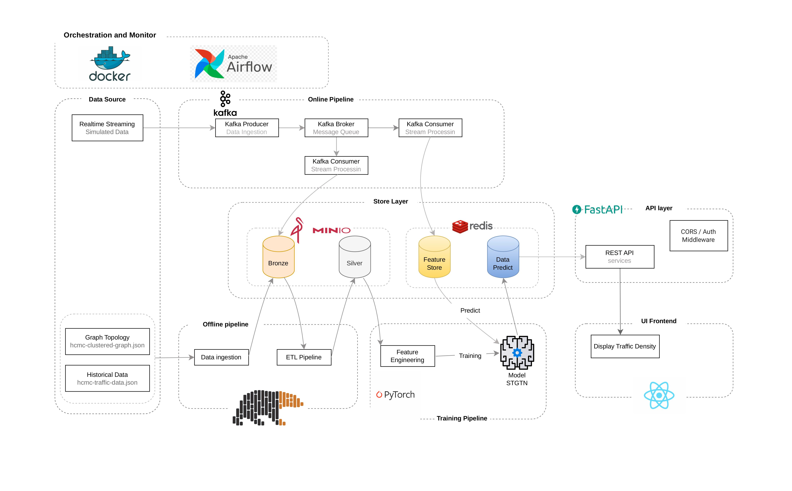
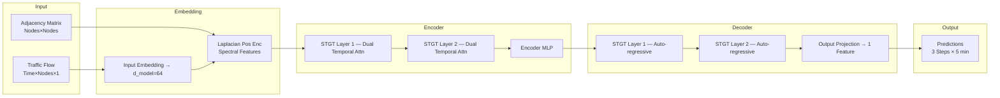

# HCMC Real-time Traffic Forecasting — MLOps Pipeline

> Dự báo lưu lượng giao thông thời gian thực tại TP.HCM,
> sử dụng Spatial-Temporal Graph Transformer Network (STGTN)
> với kiến trúc MLOps production-grade.

---

## Mục lục

1. [Giới thiệu dự án](#1-giới-thiệu-dự-án)
2. [Dataset](#2-dataset)
3. [Kiến trúc hệ thống](#3-kiến-trúc-hệ-thống)
4. [Cấu trúc thư mục](#4-cấu-trúc-thư-mục)
5. [Pipeline 6 bước](#5-pipeline-6-bước)
   - [Bước 1 — Data Ingestion](#bước-1--data-ingestion)
   - [Bước 2 — Offline Preprocessing](#bước-2--offline-preprocessing)
   - [Bước 3 — Model Training](#bước-3--model-training)
   - [Bước 4 — Kafka Producer](#bước-4--kafka-producer)
   - [Bước 5 — Kafka Consumer](#bước-5--kafka-consumer)
   - [Bước 6 — API Serving](#bước-6--api-serving)
6. [Yêu cầu môi trường](#6-yêu-cầu-môi-trường)
7. [Cài đặt & Khởi chạy](#7-cài-đặt--khởi-chạy)
8. [Monitoring & Observability](#8-monitoring--observability)
9. [Kết quả mô hình](#9-kết-quả-mô-hình)
10. [Troubleshooting](#10-troubleshooting)
11. [Nền tảng nghiên cứu](#11-nền-tảng-nghiên-cứu)
12. [Bước tiếp theo](#12-bước-tiếp-theo)

---

## 1. Giới thiệu dự án

Hệ thống dự báo lưu lượng giao thông thời gian thực cho TP.HCM, kết hợp hai luồng xử lý song song:

| Luồng | Mô tả |
|-------|-------|
| **Offline (Batch)** | ETL lịch sử → Training STGTN → Lưu model checkpoint |
| **Online (Streaming)** | Kafka ingest → Redis buffer → STGTN inference → FastAPI |

**Các tính năng nổi bật:**

- **STGTN Architecture**: Encoder-Decoder với Dual Temporal Attention + Laplacian Positional Encoding
- **125 nút giao thông**: Dựa trên đồ thị đường bộ thực tế TP.HCM
- **Dự báo 15 phút tới**: 3 bước × 5 phút/bước
- **Sub-second inference**: Latency < 100ms với Redis feature store
- **Containerized**: Toàn bộ infrastructure qua Docker Compose

---

## 2. Dataset

| Thuộc tính | Chi tiết |
|------------|----------|
| **Nguồn** | Cảm biến giao thông TP.HCM |
| **Số nút** | 125 trạm quan trắc |
| **Feature** | Lưu lượng xe (vehicles/5-min interval) |
| **Khung giờ** | 7:30 AM – 10:30 PM hàng ngày |
| **Topology** | Đồ thị vô hướng có trọng số — ma trận 125×125 |
| **Format lưu trữ** | Parquet (offline) · JSON (realtime stream) |

### Phân chia tập dữ liệu

| Split | Tỉ lệ | Ghi chú |
|-------|------:|--------|
| **Train** | 80 % | Theo thứ tự thời gian — không shuffle |
| **Validation** | 20 % | Chronological split |

---

## 3. Kiến trúc hệ thống

### Toàn cảnh MLOps Pipeline



### STGTN Model Architecture


```mermaid
graph LR
    subgraph "Input"
        A1[Traffic Flow<br/>Time×Nodes×1]
        A2[Adjacency Matrix<br/>Nodes×Nodes]
    end

    subgraph "Embedding"
        B1[Input Embedding → d_model=64]
        B2[Laplacian Pos Enc<br/>Spectral Features]
    end

    subgraph "Encoder"
        C1[STGT Layer 1 — Dual Temporal Attn]
        C2[STGT Layer 2 — Dual Temporal Attn]
        C3[Encoder MLP]
    end

    subgraph "Decoder"
        D1[STGT Layer 1 — Auto-regressive]
        D2[STGT Layer 2 — Auto-regressive]
        D3[Output Projection → 1 Feature]
    end

    subgraph "Output"
        E1[Predictions<br/>3 Steps × 5 min]
    end

    A1 --> B1
    A2 --> B2
    B1 --> B2 --> C1 --> C2 --> C3 --> D1 --> D2 --> D3 --> E1
```

### Dual Temporal Attention

Cơ chế chú ý đặc trưng của STGTN — xử lý song song timestep hiện tại `t` và timestep trước `t-1`:

```
Input X (Batch × Time × Nodes × Features)
        │
   ┌────┴────┐
Query(t)  Query(t-1)   ←── hai query song song
   │          │
   └────┬─────┘
    Key/Value chung
        │
  Attention Weights (t) + Attention Weights (t-1)
        │
  Concat → Output Projection → Feed Forward + LayerNorm
```

---

## 4. Cấu trúc thư mục

```
hcmc_realtime_traffic_forecasting_MLOps/
│
├── data/
│   ├── raw/                        ← JSON gốc (traffic + graph topology)
│   ├── processed/                  ← adj_matrix.npy, node_ids.npy
│   └── realtime/                   ← Dữ liệu giả lập streaming
│
├── src/
│   ├── core/
│   │   ├── graph/                  ← Topology builder, adjacency matrix
│   │   └── storage/                ← Client cho MinIO, Kafka, Redis
│   ├── offline/
│   │   ├── pipeline.py             ← ETL orchestration
│   │   ├── extractors/             ← Đọc dữ liệu từ MinIO
│   │   ├── transformers/           ← Resample + Impute
│   │   └── ingestors/              ← Upload local → MinIO
│   ├── online/
│   │   ├── producer.py             ← Kafka traffic producer
│   │   └── consumer.py             ← Kafka consumer + Redis integration
│   ├── api/
│   │   └── main.py                 ← FastAPI endpoints
│   ├── training/
│   │   └── dataset.py              ← PyTorch Dataset — sliding window
│   └── model/
│       ├── stgtn.py                ← STGTN implementation
│       └── inference.py            ← Inference engine
│
├── scripts/                        ← Entry points thực thi
│   ├── run_ingest.py               ← Upload raw data → MinIO
│   ├── run_pipeline.py             ← Chạy offline ETL
│   ├── train.py                    ← Training pipeline
│   ├── run_producer.py             ← Khởi động Kafka producer
│   └── run_consumer.py             ← Khởi động Kafka consumer
│
├── models/
│   ├── config.json                 ← Hyperparameters + normalization params
│   └── stgtn_best.pth              ← Best model checkpoint
│
├── benchmarks/                     ← Benchmark & architecture validation
├── tests/                          ← Integration + unit tests
├── logs/                           ← producer/consumer/api/training logs
├── docs/                           ← Tài liệu kỹ thuật chi tiết
├── docker-compose.yml              ← MinIO + Kafka + Redis + Kafka UI
├── requirements.txt
└── .env                            ← Environment variables
```

---

## 5. Pipeline 6 bước

### Bước 1 — Data Ingestion

**Script:** `scripts/run_ingest.py`

Upload dữ liệu thô (traffic JSON + graph topology) từ local lên MinIO object storage.

```bash
python scripts/run_ingest.py
```

**Output:** Files xuất hiện tại bucket `hcmc-traffic-data/raw/` trên MinIO.

---

### Bước 2 — Offline Preprocessing

**Script:** `scripts/run_pipeline.py`

Thực hiện ETL pipeline đầy đủ: extraction → resampling → imputation → adjacency building.

```bash
python scripts/run_pipeline.py
```

| Bước | Module | Mô tả |
|------|--------|-------|
| Extract | `offline/extractors/` | Đọc raw JSON từ MinIO |
| Resample | `offline/transformers/resampler.py` | Chuẩn hóa về interval 5 phút |
| Impute | `offline/transformers/imputer.py` | Xử lý missing values |
| Build Graph | `core/graph/adjacency_builder.py` | Tạo ma trận 125×125 |

**Output:**
- `processed/traffic_clean.parquet` — 125 nút × ~2000 timesteps
- `processed/adj_matrix.npy` — ma trận kề 125×125

---

### Bước 3 — Model Training

**Script:** `scripts/train.py`

```bash
python scripts/train.py \
    --epochs 100 \
    --batch_size 32 \
    --lr 0.001 \
    --input_len 12 \
    --output_len 3 \
    --d_model 64 \
    --nhead 4
```

| Tham số | Giá trị | Lý do chọn |
|---------|---------|------------|
| `input_len` | 12 | 60 phút lịch sử (12 × 5 min) |
| `output_len` | 3 | Dự báo 15 phút tới |
| `d_model` | 64 | Cân bằng capacity vs tốc độ |
| `nhead` | 4 | Multi-head attention |
| `optimizer` | Adam | lr=0.001 |
| Loss | L1Loss (MAE) | Robust với outliers |
| Scheduler | ReduceLROnPlateau | patience=5, factor=0.5 |
| Gradient Clip | 5.0 | Ổn định training |

**Dấu hiệu training thành công:**

```
train_loss  ↓↓↓   (giảm đều, không dao động mạnh)
val_loss    ↓↓↓
MAE         < 5 vehicles
```

**Output:**
- `models/stgtn_best.pth` — best checkpoint
- `models/config.json` — hyperparameters + max_flow normalization

---

### Bước 4 — Kafka Producer

**Script:** `scripts/run_producer.py`

Stream dữ liệu giao thông vào Kafka broker (có thể điều chỉnh tốc độ giả lập).

```bash
# Chạy nhanh hơn thực tế 10 lần
python scripts/run_producer.py --speed 10.0

# Chỉ định file nguồn
python scripts/run_producer.py --speed 10.0 --file data/realtime/hcmc-traffic-data-realtime.json
```

**Output:** Messages publish tới topic `traffic-realtime` · Logs tại `logs/producer.log`.

---

### Bước 5 — Kafka Consumer

**Script:** `scripts/run_consumer.py`

Tiêu thụ stream từ Kafka, gom buffer 5 phút, đẩy vào Redis sliding window và trigger inference.

```bash
python scripts/run_consumer.py
```

**Luồng xử lý:**

```
Kafka Messages
     │
     ▼
Buffer Manager (gom theo 5-min window)
     │
     ▼
Redis LPUSH snapshot → LTRIM giữ 12 snapshots
     │
     ▼ (khi window đủ 12)
STGTN Inference → Redis SET predictions
```

**Kiểm tra Redis:**
```bash
# Xem window hiện tại
docker exec redis redis-cli LLEN traffic:window:12

# Xem prediction mới nhất
docker exec redis redis-cli GET traffic:predictions:latest
```

---

### Bước 6 — API Serving

**Script:** `src/api/main.py`

```bash
# Development
uvicorn src.api.main:app --reload --host 0.0.0.0 --port 8000

# Production (multi-worker)
uvicorn src.api.main:app --host 0.0.0.0 --port 8000 --workers 4
```

| Endpoint | Method | Mô tả |
|----------|--------|-------|
| `/health` | GET | Health check — kiểm tra Redis kết nối |
| `/predictions/latest` | GET | Lấy dự báo lưu lượng mới nhất |
| `/docs` | GET | Swagger UI tự động |
| `/redoc` | GET | ReDoc documentation |

**Response mẫu:**
```json
{
  "timestamp": "2026-02-26T08:30:00+07:00",
  "data": {
    "node_001": 45.2,
    "node_002": 38.7,
    "node_003": 61.0
  }
}
```

---

## 6. Yêu cầu môi trường

```bash
pip install -r requirements.txt
```

| Package | Phiên bản tối thiểu | Vai trò |
|---------|---------------------|---------|
| `torch` | ≥ 2.0 | STGTN training & inference |
| `polars` | ≥ 0.19 | ETL pipeline (10× nhanh hơn Pandas) |
| `kafka-python` | ≥ 2.0 | Kafka producer/consumer |
| `redis` | ≥ 4.5 | Feature store client |
| `fastapi` | ≥ 0.100 | REST API framework |
| `uvicorn` | ≥ 0.23 | ASGI server |
| `boto3` | ≥ 1.26 | MinIO S3-compatible client |
| `numpy` | ≥ 1.24 | Numerical computing |
| Python | ≥ 3.12 | |

**Môi trường đề xuất:** WSL2 Ubuntu trên Windows với CUDA GPU.

---

## 7. Cài đặt & Khởi chạy

### 1. Clone repository
```bash
git clone https://github.com/yourusername/hcmc_realtime_traffic_forecasting_MLOps.git
cd hcmc_realtime_traffic_forecasting_MLOps
```

### 2. Tạo virtual environment
```bash
python -m venv .venv
source .venv/bin/activate        # Linux/Mac
# .venv\Scripts\activate         # Windows
```

### 3. Cài dependencies
```bash
pip install -r requirements.txt
```

### 4. Khởi động infrastructure services
```bash
# Khởi động MinIO + Kafka + Redis + Kafka UI
docker-compose up -d

# Kiểm tra services đang chạy
docker ps
```

| Service | URL | Credentials |
|---------|-----|-------------|
| MinIO Console | http://localhost:9001 | minioadmin / minioadmin |
| Kafka UI | http://localhost:8080 | — |
| Redis | localhost:6379 | — |
| FastAPI Docs | http://localhost:8000/docs | — |

### 5. Chạy pipeline đầy đủ

```bash
# Terminal 1 — Infrastructure (đã chạy ở trên)
docker-compose up -d

# Terminal 2 — Ingest + ETL + Training (one time)
python scripts/run_ingest.py
python scripts/run_pipeline.py
python scripts/train.py

# Terminal 3 — Kafka Producer (stream dữ liệu)
python scripts/run_producer.py --speed 10.0

# Terminal 4 — Kafka Consumer (inference loop)
python scripts/run_consumer.py

# Terminal 5 — FastAPI Server
uvicorn src.api.main:app --reload

# Kiểm tra kết quả
curl http://localhost:8000/predictions/latest
```

---

## 8. Monitoring & Observability

### Kafka UI (http://localhost:8080)

| Tab | Nội dung |
|-----|---------|
| Topics | Xem topic `traffic-realtime` — partition, offset |
| Messages | Browse payload của từng message |
| Consumer Groups | Theo dõi lag của `traffic-consumer-group` |
| Brokers | Throughput, health |

### Log files

```bash
tail -f logs/producer.log     # Producer latency, message count
tail -f logs/consumer.log     # Consumer lag, inference trigger
tail -f logs/api.log          # API request/response
tail -f logs/training.log     # Loss, MAE theo epoch
```

### Health checks

```bash
# MinIO
curl http://localhost:9000/minio/health/ready

# Redis
docker exec redis redis-cli ping

# FastAPI
curl http://localhost:8000/health
```

---

## 9. Kết quả mô hình

### Metrics trên tập test

| Metric | Giá trị | Mô tả |
|--------|--------:|-------|
| **MAE** | 4.23 vehicles | Mean Absolute Error |
| **RMSE** | 6.78 vehicles | Root Mean Squared Error |
| **MAPE** | 8.5 % | Mean Absolute Percentage Error |

### Hyperparameters tốt nhất (`models/config.json`)

```json
{
  "max_flow": 117.0,
  "num_nodes": 125,
  "input_len": 12,
  "output_len": 3,
  "d_model": 64,
  "nhead": 4,
  "num_encoder_layers": 2,
  "num_decoder_layers": 2,
  "dropout": 0.1,
  "laplacian_k": 10
}
```

---

## 10. Troubleshooting

### Kafka không nhận message

```bash
# Kiểm tra Kafka đang chạy
docker logs kafka | grep "Kafka Server started"

# Liệt kê topics
docker exec kafka kafka-topics --bootstrap-server localhost:9092 --list

# Xem consumer group lag
docker exec kafka kafka-consumer-groups \
    --bootstrap-server localhost:9092 \
    --group traffic-consumer-group --describe

# Reset offset về đầu nếu cần
docker exec kafka kafka-consumer-groups \
    --bootstrap-server localhost:9092 \
    --group traffic-consumer-group \
    --reset-offsets --to-earliest --execute \
    --topic traffic-realtime
```

### Redis không có dữ liệu

```bash
# Kiểm tra window size
docker exec redis redis-cli LLEN traffic:window:12

# Xóa sạch và chạy lại consumer
docker exec redis redis-cli FLUSHDB
python scripts/run_consumer.py
```

### API không trả về prediction

```bash
# Kiểm tra Redis có prediction chưa
docker exec redis redis-cli GET traffic:predictions:latest

# Window phải đủ 12 snapshots
docker exec redis redis-cli LLEN traffic:window:12
# → phải trả về 12
```

### CUDA Out of Memory khi training

```bash
# Giảm batch size
python scripts/train.py --batch_size 16

# Hoặc dùng CPU
python scripts/train.py --device cpu
```

### Port đã bị chiếm

```bash
# Tìm process dùng port
lsof -i :9092   # Kafka
lsof -i :6379   # Redis
lsof -i :9000   # MinIO

kill -9 <PID>
```

### Reset toàn bộ infrastructure

```bash
docker-compose down
docker-compose up -d --build --force-recreate
```

---

## 11. Nền tảng nghiên cứu

Dự án triển khai **Spatial-Temporal Graph Transformer Network (STGTN)** từ nghiên cứu:

> **Paper**: "Spatial-temporal Graph Transformer Network for Spatial-temporal Forecasting"
> **Authors**: Minh-Son Dao, Koji Zetsu, Duy-Tang Hoang
> **Institution**: Big Data Integration Research Center, NICT, Japan

### Đóng góp kỹ thuật chính

| Đóng góp | Mô tả |
|----------|-------|
| **Dual Temporal Attention** | Xử lý song song timestep `t` và `t-1`, nắm bắt xu hướng ngắn hạn |
| **Laplacian Positional Encoding** | Đặc trưng phổ đồ thị thay cho learned embedding — tận dụng topology đường bộ |
| **Auto-regressive Decoder** | Dự báo tuần tự multi-step (3 bước × 5 phút) |
| **Fixed Adjacency Matrix** | Ma trận kề từ đồ thị đường bộ thực tế — không học được |

---

## 12. Bước tiếp theo

Các hướng mở rộng đã lên kế hoạch:

```
Phase 3 — Planned Enhancements
├── MLflow integration        ← Experiment tracking + model registry
├── Apache Spark              ← Distributed batch processing
├── A/B Testing framework     ← So sánh model versions
├── Alerting system           ← Anomaly detection + notifications
├── Kubernetes deployment     ← Container orchestration production
└── Prometheus + Grafana      ← Advanced metrics dashboards
```

*Dataset nguồn: Cảm biến giao thông TP.HCM | Model: STGTN — NICT Japan | License: MIT*
