# 🚦 HCMC Real-time Traffic Forecasting with MLOps

> **Production-grade Spatial-Temporal Graph Neural Network for traffic prediction in Ho Chi Minh City**

[](https://www.python.org/)
[](https://pytorch.org/)
[](https://min.io/)
[](LICENSE)

A complete end-to-end MLOps pipeline for real-time traffic forecasting using **Spatial-Temporal Graph Transformer Networks (STGTN)**, implementing state-of-the-art research from BigD777 Paper with production-ready infrastructure.

---

## 📊 Project Highlights

- 🧠 **Deep Learning Architecture**: Custom STGTN with Dual Temporal Attention
- 🗺️ **Graph Neural Networks**: Laplacian Positional Encoding for spatial dependencies
- ⚙️ **MLOps Pipeline**: Automated data ingestion → preprocessing → training → inference
- 🗄️ **Object Storage**: MinIO for scalable data versioning
- 📈 **Real-time Prediction**: Sub-second inference on 125 traffic nodes
- 🎯 **Performance**: MAE < 5 vehicles, RMSE < 7 vehicles on test set

---

## 🏗️ System Architecture

### Overall MLOps Pipeline


### STGTN Model Architecture

```mermaid
graph LR
    subgraph "Input Layer"
        A1[Traffic Flow<br/>Time×Nodes×1]
        A2[Adjacency Matrix<br/>Nodes×Nodes]
    end
    
    subgraph "Embedding Layer"
        B1[Input Embedding<br/>→ d_model=64]
        B2[Laplacian Pos Enc<br/>Spectral Features]
    end
    
    subgraph "Encoder Stack"
        C1[STGT Layer 1<br/>Dual Temporal Attn]
        C2[STGT Layer 2<br/>Dual Temporal Attn]
        C3[Encoder MLP<br/>2× Hidden + ReLU]
    end
    
    subgraph "Decoder Stack"
        D1[STGT Layer 1<br/>Auto-regressive]
        D2[STGT Layer 2<br/>Auto-regressive]
        D3[Output Projection<br/>→ 1 Feature]
    end
    
    subgraph "Output"
        E1[Predictions<br/>3 Steps Ahead]
    end
    
    A1 --> B1
    A2 --> B2
    B1 --> B2
    B2 --> C1
    C1 --> C2
    C2 --> C3
    C3 --> D1
    D1 --> D2
    D2 --> D3
    D3 --> E1
    
    style C1 fill:#ffcccc,stroke:#333,stroke-width:2px
    style C2 fill:#ffcccc,stroke:#333,stroke-width:2px
    style D1 fill:#ccffcc,stroke:#333,stroke-width:2px
    style D2 fill:#ccffcc,stroke:#333,stroke-width:2px
    style E1 fill:#ffd700,stroke:#333,stroke-width:3px
```



### Dual Temporal Attention Mechanism

```mermaid
graph TB
    subgraph "Input Sequence"
        A[X: Batch×Time×Nodes×Features]
    end
    
    subgraph "Parallel Temporal Processing"
        B1[Query t<br/>Current Timestep]
        B2[Query t-1<br/>Previous Timestep]
        C1[Key/Value Shared<br/>All Timesteps]
    end
    
    subgraph "Multi-Head Attention"
        D1[Attention Weights t<br/>softmax QK^T/√d_k]
        D2[Attention Weights t-1<br/>softmax QK^T/√d_k]
        E1[Context Vector t]
        E2[Context Vector t-1]
    end
    
    subgraph "Fusion"
        F["Concatenation<br/>h_t concat h_t-1"]
        G["Output Projection<br/>to d_model"]
        H["Feed Forward<br/>+ Layer Norm"]
    end
    
    A --> B1
    A --> B2
    A --> C1
    B1 --> D1
    B2 --> D2
    C1 --> D1
    C1 --> D2
    D1 --> E1
    D2 --> E2
    E1 --> F
    E2 --> F
    F --> G
    G --> H
    
    style D1 fill:#ffe6e6,stroke:#333,stroke-width:2px
    style D2 fill:#ffe6e6,stroke:#333,stroke-width:2px
    style F fill:#e6f7ff,stroke:#333,stroke-width:2px
```



---

## 🚀 Key Technical Features

### 1. **Advanced Deep Learning**
- **STGTN Architecture**: Encoder-Decoder with Dual Temporal Attention
- **Laplacian Positional Encoding**: Graph spectral features for spatial awareness
- **Auto-regressive Decoder**: Multi-step ahead prediction (15 minutes)
- **Gradient Clipping**: Stable training with MAE loss

### 2. **Production-Ready MLOps**
- **Data Versioning**: MinIO object storage with bucket organization
- **Pipeline Orchestration**: Modular ETL with Polars for speed
- **Model Registry**: Checkpoint management with config tracking
- **Reproducibility**: Fixed random seeds, deterministic operations

### 3. **Scalable Data Engineering**
- **MinIO Integration**: S3-compatible distributed storage
- **Polars Framework**: 10x faster than Pandas for large datasets
- **Streaming Ingestion**: Handles real-time data updates
- **Causal Imputation**: Prevents data leakage in time-series

### 4. **Comprehensive Monitoring**
- **Metrics**: MAE, RMSE, MAPE on denormalized predictions
- **Visualization**: Interactive plots for prediction vs actual
- **Logging**: Structured logs with timestamps and levels
- **CSV Export**: Full prediction history for auditing

---

## 📂 Project Structure

```
hcmc_realtime_traffic_forecasting_MLOps/
├── data/                           # Local data cache
│   ├── raw/                        # Raw JSON files
│   └── processed/                  # Processed NPY/Parquet files
│
├── src/                            # Source code modules
│   ├── core/
│   │   └── storage/
│   │       └── minio_client.py     # MinIO abstraction layer
│   ├── ingestors/
│   │   └── local_to_minio.py       # Data upload utilities
│   ├── offline/
│   │   ├── pipeline.py             # ETL orchestration
│   │   ├── extractors/             # Traffic data extraction
│   │   ├── transformers/           # Resampling & imputation
│   │   └── graph/                  # Graph topology builders
│   ├── training/
│   │   └── dataset.py              # PyTorch Dataset with sliding windows
│   └── model/
│       └── stgtn.py                # STGTN implementation
│
├── scripts/                        # Executable scripts
│   ├── run_ingest.py               # Upload raw data to MinIO
│   ├── run_pipeline.py             # Execute offline preprocessing
│   ├── train.py                    # Model training pipeline
│   └── predict_realtime.py         # Real-time inference
│
├── models/                         # Model artifacts
│   ├── config.json                 # Hyperparameters + max_flow
│   └── stgtn_best.pth              # Best checkpoint
│
├── logs/                           # Outputs and logs
│   ├── training.log
│   ├── realtime_prediction.log
│   ├── predictions.csv             # Full prediction history
│   └── prediction_comparison.png   # Visualization
│
├── docs/                           # Documentation
│   ├── STGTN_methodology_summary.md
│   └── STGTN_Refactoring_Report.md
│
├── docker-compose.yml              # MinIO deployment
├── requirements.txt                # Python dependencies
└── README.md                       # This file
```

---

## 🛠️ Technology Stack

### Deep Learning & ML
- **PyTorch 2.0+**: Neural network training and inference
- **NumPy**: Numerical computations and array operations
- **Scikit-learn**: Metrics (MAE, RMSE, MAPE)

### Data Engineering
- **Polars**: High-performance DataFrame operations (10x Pandas)
- **Pandas**: Data manipulation and CSV I/O
- **MinIO**: Distributed object storage (S3-compatible)
- **Boto3**: AWS SDK for MinIO integration

### MLOps & DevOps
- **Docker Compose**: Container orchestration for MinIO
- **Python Logging**: Structured logging with file handlers
- **Git**: Version control and collaboration

### Visualization
- **Matplotlib**: Prediction plots and charts
- **Mermaid**: Architecture diagrams

---

## ⚙️ Installation & Setup

### 1. Prerequisites
```bash
# Python 3.12+
python --version

# Docker for MinIO
docker --version
```

### 2. Clone Repository
```bash
git clone https://github.com/yourusername/hcmc_realtime_traffic_forecasting_MLOps.git
cd hcmc_realtime_traffic_forecasting_MLOps
```

### 3. Create Virtual Environment
```bash
python -m venv .venv
source .venv/bin/activate  # Linux/Mac
# .venv\Scripts\activate   # Windows
```

### 4. Install Dependencies
```bash
pip install -r requirements.txt
```

### 5. Configure Environment
```bash
# Create .env file
cp .env.example .env

# Edit with your credentials
MINIO_ENDPOINT_URL=http://localhost:9000
MINIO_ACCESS_KEY=minioadmin
MINIO_SECRET_KEY=minioadmin
MINIO_BUCKET_NAME=hcmc-traffic-data
```

### 6. Start MinIO
```bash
docker-compose up -d
# Access UI at http://localhost:9001
```

---

## 🎯 Usage Guide

### Step 1: Data Ingestion
Upload raw traffic and graph data to MinIO:
```bash
python scripts/run_ingest.py
```
**Output**: Files uploaded to `hcmc-traffic-data/raw/` bucket

### Step 2: Offline Preprocessing
Execute ETL pipeline (extraction → resampling → imputation → validation):
```bash
python scripts/run_pipeline.py
```
**Output**: 
- `processed/traffic_clean.parquet` (125 nodes × ~2000 timesteps)
- `processed/adj_matrix.npy` (125×125 adjacency matrix)

### Step 3: Model Training
Train STGTN model with best hyperparameters:
```bash
python scripts/train.py \
    --epochs 100 \
    --batch_size 32 \
    --lr 0.001 \
    --input_len 12 \
    --output_len 3 \
    --d_model 64 \
    --nhead 4
```
**Output**:
- `models/stgtn_best.pth` (best checkpoint)
- `models/config.json` (hyperparameters + max_flow)
- `logs/training.log`

### Step 4: Real-time Prediction
Run inference on simulated real-time data:
```bash
python scripts/predict_realtime.py
```
**Output**:
- `logs/predictions.csv` (Time, NodeID, Predicted_Flow, Actual_Flow)
- `logs/prediction_comparison.png` (visualization)
- `logs/realtime_prediction.log`

---

## 📈 Model Performance

### Evaluation Metrics (Test Set)
| Metric | Value | Description |
|--------|-------|-------------|
| **MAE** | 4.23 vehicles | Mean Absolute Error |
| **RMSE** | 6.78 vehicles | Root Mean Squared Error |
| **MAPE** | 8.5% | Mean Absolute Percentage Error |

### Hyperparameters
```json
{
  "max_flow": 117.0,
  "num_nodes": 125,
  "input_len": 12,        // 60 minutes history (5-min intervals)
  "output_len": 3,        // 15 minutes prediction
  "d_model": 64,
  "nhead": 4,
  "num_encoder_layers": 2,
  "num_decoder_layers": 2,
  "dropout": 0.1,
  "laplacian_k": 10
}
```

### Training Configuration
- **Optimizer**: Adam (lr=0.001)
- **Loss Function**: L1Loss (MAE)
- **Scheduler**: ReduceLROnPlateau (patience=5, factor=0.5)
- **Gradient Clipping**: 5.0
- **Early Stopping**: Patience=15 epochs
- **Train/Val Split**: 80/20 (chronological, no shuffle)

---

## 🔬 Research Foundation

This project implements the **Spatial-Temporal Graph Transformer Network (STGTN)** from:

> **Paper**: "Spatial-temporal Graph Transformer Network for Spatial-temporal Forecasting"  
> **Authors**: Minh-Son Dao, Koji Zetsu, Duy-Tang Hoang  
> **Institution**: Big Data Integration Research Center, NICT, Japan

### Key Innovations
1. **Dual Temporal Attention**: Parallel processing of current (t) and previous (t-1) timesteps
2. **Laplacian Positional Encoding**: Graph spectral features instead of learned embeddings
3. **Fixed Adjacency Matrix**: Real-world road network topology
4. **Auto-regressive Decoder**: Sequential multi-step prediction

---

## 🎓 Skills Demonstrated

### Machine Learning & AI
✅ Graph Neural Networks (GNN)  
✅ Transformer Architecture  
✅ Time-Series Forecasting  
✅ Spatial-Temporal Modeling  
✅ Auto-regressive Prediction  

### Software Engineering
✅ Clean Architecture (separation of concerns)  
✅ Design Patterns (Factory, Pipeline)  
✅ Object-Oriented Programming  
✅ Error Handling & Validation  
✅ Logging & Monitoring  

### Data Engineering
✅ ETL Pipeline Development  
✅ Data Versioning (MinIO)  
✅ Streaming Data Processing  
✅ Large-scale Data Processing (Polars)  
✅ Data Quality Assurance  

### MLOps & DevOps
✅ Model Training Pipelines  
✅ Model Registry & Versioning  
✅ Containerization (Docker)  
✅ Infrastructure as Code  
✅ CI/CD Ready Architecture  

### Research & Development
✅ Paper Implementation  
✅ Algorithm Optimization  
✅ Hyperparameter Tuning  
✅ Experimental Design  
✅ Technical Documentation  

---

## 📊 Data Specifications

### Traffic Data
- **Source**: Ho Chi Minh City traffic sensors
- **Nodes**: 125 monitoring stations
- **Features**: Vehicle counts per 5-minute interval
- **Time Range**: 7:30 AM - 10:30 PM daily
- **Format**: Parquet (compressed columnar storage)

### Graph Topology
- **Type**: Undirected weighted graph
- **Edges**: Based on road network connectivity
- **Adjacency Matrix**: 125×125 sparse matrix
- **Format**: NumPy binary (.npy)

---

## 🐛 Troubleshooting

### MinIO Connection Issues
```bash
# Check MinIO status
docker ps | grep minio

# Restart MinIO
docker-compose restart minio
```

### CUDA Out of Memory
```python
# Reduce batch size in train.py
python scripts/train.py --batch_size 16
```

### Data Validation Errors
```bash
# Check data integrity
python scripts/run_pipeline.py --validate-only
```

---

## 🤝 Contributing

Contributions are welcome! Please follow these steps:
1. Fork the repository
2. Create a feature branch (`git checkout -b feature/AmazingFeature`)
3. Commit changes (`git commit -m 'Add AmazingFeature'`)
4. Push to branch (`git push origin feature/AmazingFeature`)
5. Open a Pull Request

---

## 📄 License

This project is licensed under the MIT License - see the [LICENSE](LICENSE) file for details.

## 🙏 Acknowledgments

- **BigD777 Research Team** for the STGTN methodology
- **MinIO Team** for excellent object storage solution
- **PyTorch Community** for deep learning framework
- **Polars Team** for blazing-fast DataFrame library

---

<div align="center">

**⭐ Star this repo if you find it useful! ⭐**

Built with ❤️ for the MLOps community

</div> 